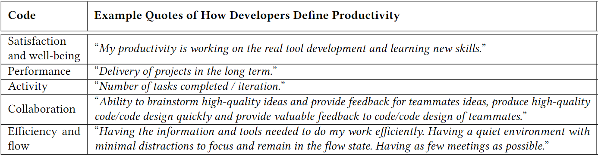

In this article, I break down the report: How Developers and Managers Define and Trade Productivity for Quality.

> 💡 This is the latest article on my newsletter. Every week I break down papers on developer productivity.

## TL;DR:

- **Developers and managers** have **different views on productivity** - developers think more about work activities, while more managers consider performance or quality outcomes.
- **Developers and managers** have a **more aligned views on quality -** emphasizing **robustness and sustainable evolution of software**.
- **Effective communication** between developers and managers is essential for aligning views.
- Most developers and managers **trade quality for productivity.**

This week I read _How Developers and Managers Define and Trade Productivity for Quality_ by Margaret-Anne Storey (University of Victoria), Brian Houck (Microsoft) and Thomas Zimmermann (Microsoft Research).

> 👉 You can read the full paper [here](https://arxiv.org/abs/2111.04302).

It's worth mentioning that these authors are also known for their widely recognized paper, “**The Space of Developer Productivity**”, also known as The SPACE framework.

> 👉 You can also find The Space of Developer Productivity paper [here](https://queue.acm.org/detail.cfm?id=3454124).

This time, the objective of the authors of the paper was to understand if developers and managers, considered as cohorts, have different perspectives on the meanings of productivity and quality. The specific questions they aimed to address in the paper were as follows:

- How do developers and managers define productivity? Are their definitions aligned?
- How do developers and managers define quality? Are their definitions aligned?
- Do developers and managers prioritize productivity over quality? If so, what are the reasons behind this trade-off?

To address these questions, a survey was conducted among 1500 developers and 720 managers in the Microsoft team. However, only 131 developers and 34 managers responded to the survey.

## Some limitations.

I believe that the biggest limitation of this study is that it was conducted solely within Microsoft, a large corporation. Definitions of productivity and quality can be significantly influenced by the organizational culture, and it is possible that different definitions would arise in other organizations.

Engineers and managers working on early stage startups, still searching for product-market fit, may have (and probably should have) different perspectives on productivity and quality compared to developers and managers working at Microsoft, which serves millions of users and must adhere to strict security and robustness guidelines.

And now that I have made this disclaimer, let's continue, because I truly believe that everyone, regardless of the stage of the company they work in, can derive a lot of value from the…

## Key takeaways from the paper.

### The SPACE framework for developer productivity.

The first objective of the researchers was to understand how developers and managers defined productivity and also to determine if their perspectives were aligned.

To accomplish this, they designed [this survey for developers and managers](survey-questions.md). The authors then coded the open-ended responses, resulting in five different codes:

- Developer satisfaction and well-being
- Performance or quality outcomes of developers' work
- The activities developers accomplish within a specific time frame
- The collaborative work developers engage in
- The ability of developers to work efficiently or with fewer interruptions

Interestingly, these codes correspond to the SPACE framework, which the authors themselves developed in a previously mentioned paper titled "The Space of Developer Productivity."

In table 1, you can see some examples of how researchers associated an open-ended response to a specific code.

Table 1: Examples of how the responses to the questions about productivity were inductively coded.

The results of this classification of the responses can be seen on table 2 and it lets us understand…

### How developers and managers think about productivity.

The following table is very useful. It not only helps us understand how ICs and managers define productivity, but also how they perceive the other cohort's definition.

> _Disclaimer: You may notice that the percentages add up to more than 100 because some answers are categorized under more than one code._

To keep these short, I’m just going to point out the most important appreciations of the table:

- There is a great difference in how developers and managers define productivity. Devs are more likely to define productivity in terms of activity (_# pull requests, emails, check-ins, dev docs…_), while managers are more likely to do it in terms of performance (_tackle the right problem and get the job done, delivery of projects in the long term.._)
- ICs underestimate how often managers mention efficiency as an important aspect.
- Managers hace accurate insights on how developers define productivity.

Table 2. How Individual contributors (IC) and engineering managers think about productivity, and how they think the other cohort thinks about productivity.

### The TRUCE framework for software quality.

For the second objetive of the research, researches conducted a similar approach and designed this survey for solving their questions about how ICs and managers though about software quality.

Once again, they classified the responses with different codes. This time, the codes were the following ones:

- Timely and predictable delivery of features.
- Robustness of code (reliable, tested, secure, scales, etc.).
- Meets user, customer, stakeholder requirements/needs.
- Readable, documented code to facilitate collaboration.
- Evolvable design with tests to support future changes.

Similar to the previously mentioned SPACE framework for developer productivity, TRUCE is intended to be a framework for software quality.

In table 3, you can see some examples of how researchers associated an open-ended response to a specific code.

Table 3. Examples of how responses to the question about quality were inductively coded.

### How developers and managers think about quality.

In table 4, we can see the distributions of codes that both developers and managers used to define software quality. These are the most important takeaways for me:

- Developers and managers defined quality, as cohorts with the same inductively derived five themes.
- Over 70% of both cohorts mentioned robustness in their definitions of quality.

Table 4. How individual contributors (ICs) and engineering managers defined quality.

I have a strong opinion on this point: I believe that these percentages would vary significantly depending on the stage of the company. I can imagine that in early-stage startups, timeliness and user delight might be much more important than robustness because the preoccupation is on shipping things that people want as fast as possible.

As I mentioned earlier, this survey was conducted at Microsoft. It would be interesting to see how these percentages vary across different companies at different stages.

### Trading quality for productivity.

This is the last and third question of the research, do developers and managers trade quality for productivity?

When this question was asked, researchers discovered that most of the affirmative responses (around 50% both for managers and developers) where trading some aspects of quality for others, instead of trading quality for productivity, as we can see in figure 1.

_Figure 1. Trade-offs that developers and managers reported making when asked about trading off quality for productivity. Researches note that many reported quality trade-offs rather than quality for productivity._

In the picture we can see that both managers and developers tend to trade robustness and technical debt for other aspects of quality, such as timeliness (accomplishing deadlines), user needs or collaboration needs.

## Different lenses into software development.

While SPACE focuses more on the team and how they work and TRUCE focuses on the result of their work, there is a clear overlap between the frameworks.

Collaboration is important in both frameworks, highlighting the significance of considering how working together affects productivity and the helpful role of software quality. The Performance dimension in the SPACE framework also measures the quality of the work being done.

Although this overlap exists, both frameworks can be used to reflect on and discuss trade-offs between productivity and quality, and potentially to define metrics.

If you have any questions or would like to discuss further about engineering efficiency, feel free to reach out to me at [marco@pullpo.io](mailto:marco@pullpo.io). I'm always happy to chat and share insights.
